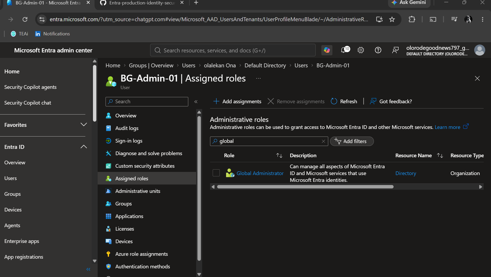

# Conditional Access Foundation

## Break-Glass Exclusion

A dedicated break-glass account was created to provide emergency administrative access if a Conditional Access policy incorrectly prevents normal administrative access.

### Account

- Account: BG-Admin-01
- Role: Global Administrator
- Purpose: Emergency tenant recovery
  
- 

### Conditional Access Design

The break-glass account will be excluded from applicable Conditional Access policies.

The exclusion is intentional and will be documented in each policy rationale.

### Security Consideration

The account is not intended for normal administrative activity.

Its credentials must be stored securely and its sign-in activity monitored.

### Testing Approach

Conditional Access policies will first be configured in Report-only mode and evaluated using What-If before enforcement.

The break-glass exclusion will be verified as part of each applicable policy test.
