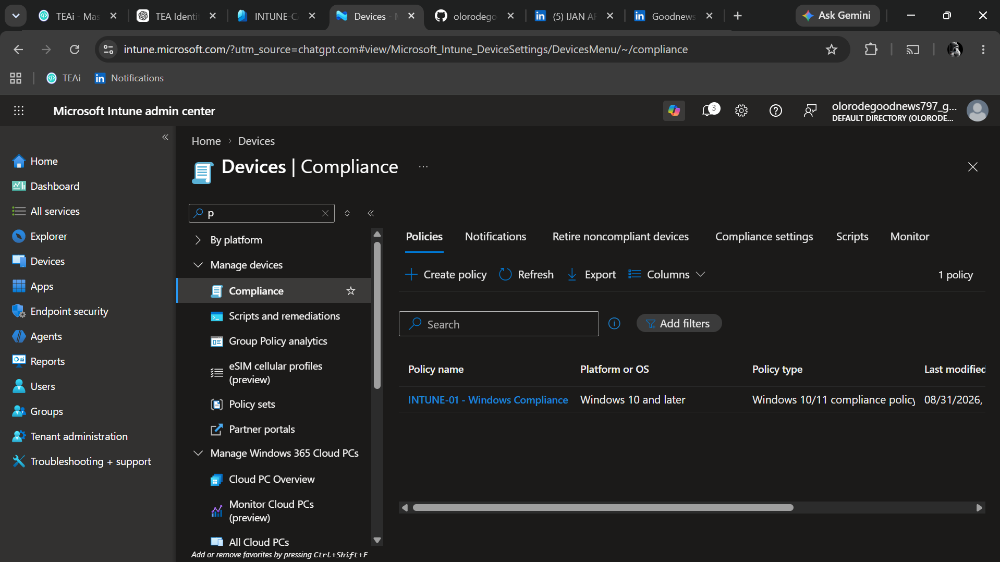

# INTUNE-01 - Windows Compliance Baseline

## Objective

Define the device security requirements used to determine whether a Windows device is compliant.

## Platform

Windows 10 and later.

## Assignment

The compliance policy is assigned to the dedicated:

`INTUNE-CA-TEST`

group.

The test group contains the Conditional Access test identity.

## Relationship With Conditional Access

Microsoft Entra Conditional Access policy `CA-02 - Device Compliance` requires the device to be marked as compliant.

Intune provides the device compliance state that Conditional Access evaluates.

## Validation

The compliance policy will be validated using an enrolled Windows test device.

The device compliance state will then be evaluated together with `CA-02 - Device Compliance`.

## Evidence

