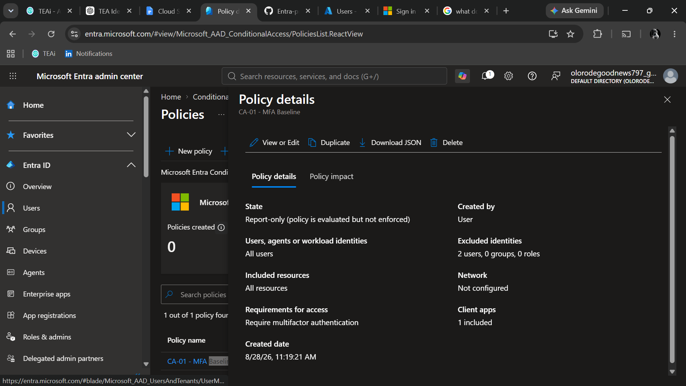
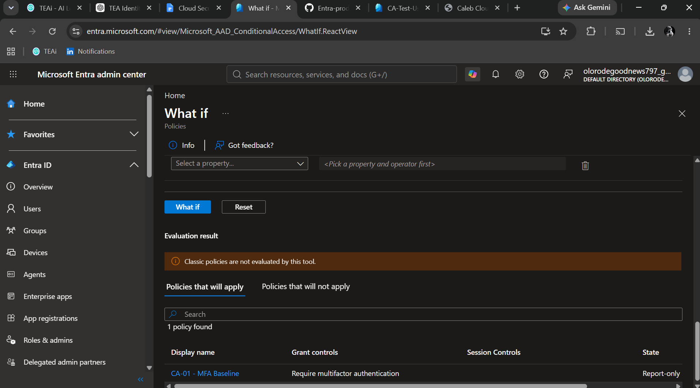
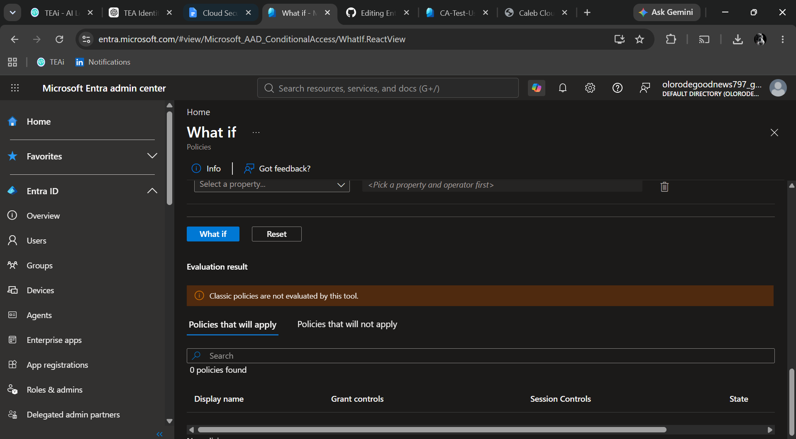

# CA-01 - MFA Baseline

## Objective

Require multifactor authentication for users accessing cloud applications.

## Security Problem

Passwords alone provide insufficient protection against credential theft, phishing, password reuse, and other credential-based attacks.

Requiring MFA adds an additional authentication factor and reduces the likelihood that a compromised password alone can be used to access cloud resources.

## Scope

### Included

All users.

### Excluded

BG-Admin-01 is excluded as a break-glass account to reduce the risk of administrative lockout caused by an incorrectly configured Conditional Access policy.

## Target Resources

All cloud applications.

## Access Control

Require multifactor authentication.

## Policy State

Report-only.

The policy is initially configured in Report-only mode so its behavior can be evaluated before enforcement.

## Testing

The policy will be tested using:

- What-If
- Report-only results
- CA-Test-User

The expected result is that CA-Test-User matches the policy and receives an MFA requirement.

The expected result for BG-Admin-01 is that the account is excluded from the policy.

## Evidence

## Final Decision

The policy will only be enabled after its behavior has been validated and the expected results have been confirmed.

## Testing

### What-If Test — CA-Test-User

The CA-Test-User identity was evaluated using Conditional Access What-If.

Expected result:

- CA-01 - MFA Baseline applies
- The policy requires multifactor authentication
- Because the policy is in Report-only mode, the requirement is evaluated but not enforced

### What-If Test — BG-Admin-01

The BG-Admin-01 identity was evaluated using Conditional Access What-If.

Expected result:

- CA-01 - MFA Baseline does not apply
- The account is excluded from the policy
- The exclusion protects emergency administrative access from this policy

### CA-Test-User What-If

### BG-Admin-01 What-If

