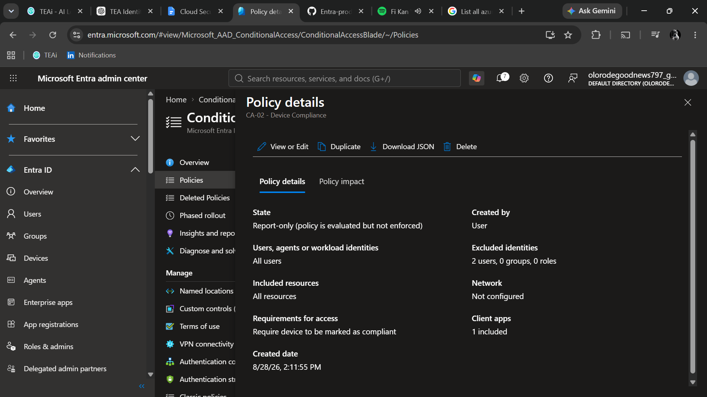
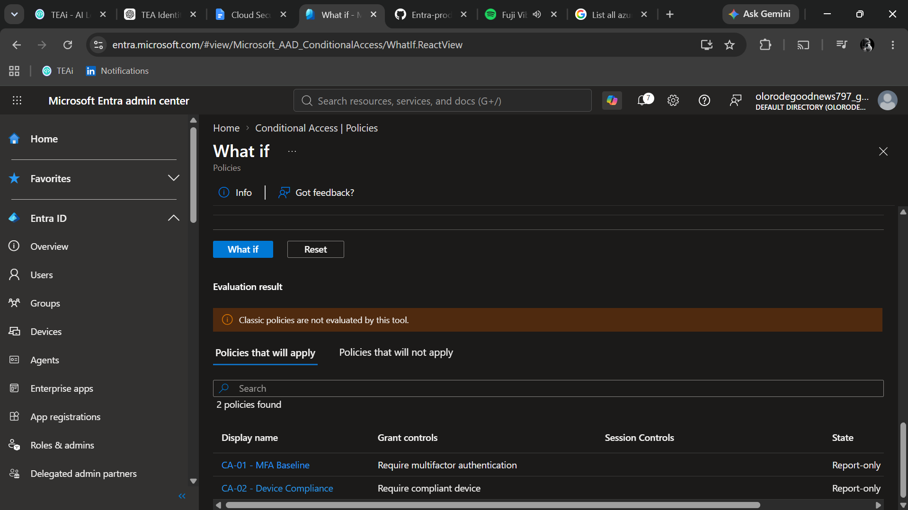
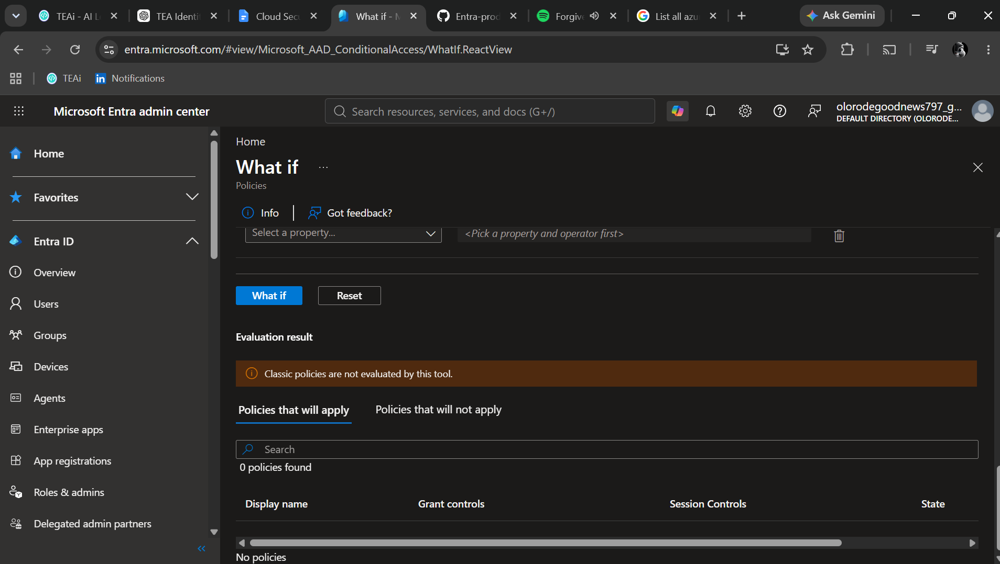

# CA-02 - Device Compliance

## Objective

Require users to access cloud resources from devices that are marked as compliant.

## Security Problem

A valid user credential does not necessarily mean that the device being used to access organizational resources is secure.

Device compliance provides an additional security signal by allowing Microsoft Entra Conditional Access to evaluate the compliance state of a managed device.

## Scope

### Included

All users.

### Excluded

BG-Admin-01 is excluded as the break-glass account to reduce the risk of administrative lockout caused by a Conditional Access configuration error.

## Target Resources

All resources.

## Access Control

Require device to be marked as compliant.

## Policy State

Report-only.

The policy is initially configured in Report-only mode so that its behavior can be evaluated before enforcement.

## Dependency

Device compliance Conditional Access depends on Microsoft Intune providing compliance information.

A compliant device and an applicable Intune compliance policy are required for full device-compliance validation.

## Testing

The policy will be evaluated using Conditional Access What-If and Report-only results.

CA-Test-User remains included in the policy.

BG-Admin-01 is excluded from the policy.

Because the current environment does not yet have a registered/compliant device, a full real-device compliance test will only be considered complete after a device is available and reports a compliance state to Microsoft Entra.

## Evidence

## Final Decision

The policy will remain in Report-only mode until its behavior and the required Intune device-compliance dependency have been validated.

## Testing 

### What-If Test — CA-Test-User

CA-Test-User was evaluated using Conditional Access What-If.

CA-02 - Device Compliance appeared in the applicable policies, confirming that the user is within the policy scope.

The What-If result confirms policy applicability but does not establish that the user's device is compliant. Device compliance requires an applicable Microsoft Intune compliance state.

### What-If Test — BG-Admin-01

BG-Admin-01 was evaluated using Conditional Access What-If.

No applicable Conditional Access policies were returned for the account, confirming that the break-glass account is excluded from CA-02 - Device Compliance.

