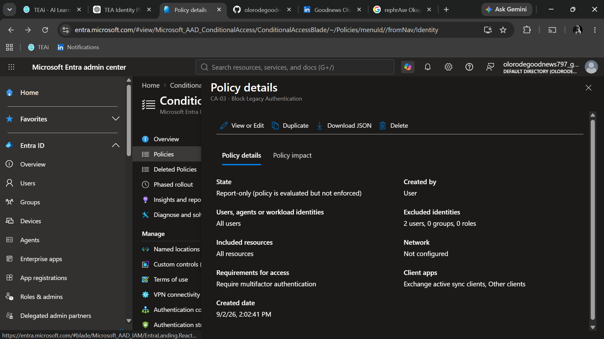

# CA-03 - Block Legacy Authentication

## Objective

Block authentication requests that use legacy authentication protocols.

## Security Problem

Legacy authentication protocols do not support modern authentication capabilities such as multifactor authentication and modern Conditional Access controls.

Applications using basic or legacy authentication may rely primarily on username and password authentication, making them a potential target for credential-based attacks.

## Policy Design

### Included Users

All users.

### Excluded Users

BG-Admin-01 is excluded as the emergency administrative account.

### Target Resources

All resources.

### Client Applications

The policy targets legacy authentication clients:

- Exchange ActiveSync clients
- Other clients

Modern authentication clients such as browsers and modern desktop applications are not targeted by this policy.

## Access Control

Block access.

The policy does not attempt to require MFA for legacy authentication.

Instead, authentication requests matching the legacy client conditions are blocked.

## Policy State

Report-only.

The policy is initially deployed in Report-only mode to evaluate potential impact before enforcement.

## Testing Approach

The policy will be validated using:

- Conditional Access What-If where applicable
- Sign-in log analysis
- Report-only results

Sign-in logs will be reviewed for legacy client activity.

## Expected Behavior

| Scenario | Expected Result |
|---|---|
| Modern browser authentication | Policy does not apply |
| Modern desktop application | Policy does not apply |
| Exchange ActiveSync legacy client | Policy applies and would block access |
| Other legacy authentication client | Policy applies and would block access |
| BG-Admin-01 | Excluded |

## Evidence

## Final Decision

The policy will remain in Report-only mode while sign-in logs are reviewed for legacy authentication activity.

The policy can be moved to enforcement after confirming that blocking legacy authentication will not disrupt required services or applications.
