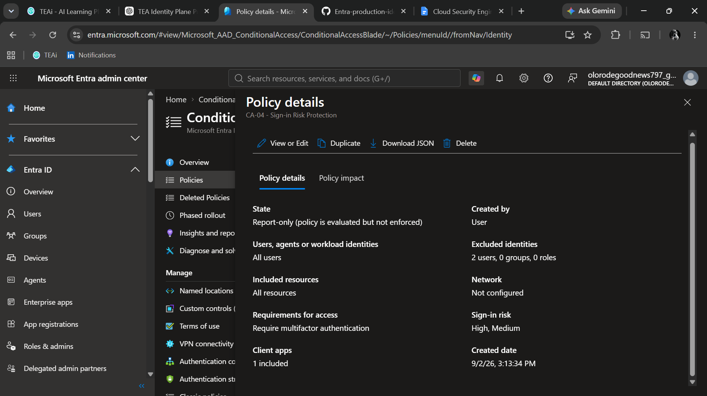

# CA-04 - Sign-in Risk Protection

## Objective

Require additional authentication when Microsoft Entra identifies a sign-in attempt with elevated risk.

## Security Problem

A valid username and password do not always guarantee that a sign-in is legitimate.

Microsoft Entra Identity Protection can detect suspicious authentication behavior and assign a risk level to individual sign-in attempts.

This policy responds to medium and high-risk sign-ins by requiring multifactor authentication.

## Policy Design

### Included Users

All users.

### Excluded Users

BG-Admin-01 is excluded as the emergency administrative account.

### Target Resources

All resources.

### Condition

Sign-in risk levels:

- Medium
- High

Low-risk sign-ins are not targeted.

## Access Control

Require multifactor authentication.

## Policy State

Report-only.

The policy is initially deployed in Report-only mode to evaluate its impact before enforcement.

## Expected Behavior

| Sign-in Risk | Expected Result |
|---|---|
| Low | Policy does not apply |
| Medium | Policy applies and requires MFA |
| High | Policy applies and requires MFA |
| BG-Admin-01 | Excluded |

## Testing Approach

The policy configuration will be validated using Conditional Access What-If where supported and sign-in logs.

Actual risk-based enforcement depends on Microsoft Entra detecting and assigning a sign-in risk level.

Artificially generating risky sign-ins is not required for this lab.

## Evidence

## Final Decision

The policy remains in Report-only mode until risk-based evaluation and production impact are reviewed.
