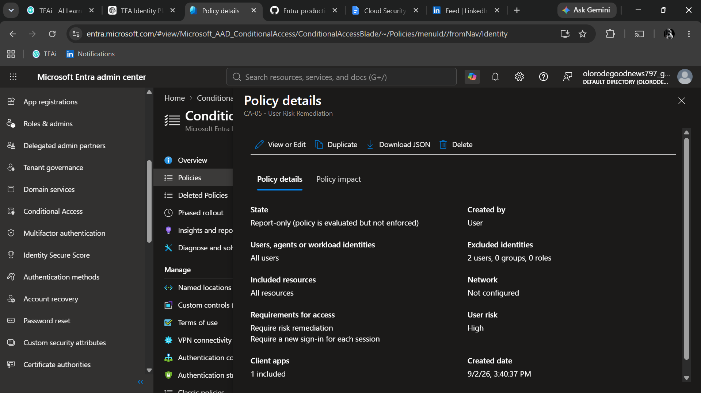

# CA-05 - User Risk Remediation

## Objective

Require remediation when Microsoft Entra identifies a user account as high risk.

## Security Problem

A user account can become compromised even when no single sign-in event is currently being evaluated as suspicious.

Microsoft Entra Identity Protection evaluates multiple security signals to determine whether a user account may be compromised.

This policy responds when the user risk level reaches High.

## Policy Design

### Included Users

All users.

### Excluded Users

BG-Admin-01 is excluded as the emergency administrative account.

### Target Resources

All resources.

### Condition

User risk level:

- High

Low and Medium user risk levels are not targeted by this policy.

## Access Control

Require risk remediation.

Risk remediation requires the user to complete the required security actions to remediate the account risk.

## Policy State

Report-only.

The policy is initially deployed in Report-only mode to evaluate behavior before enforcement.

## Expected Behavior

| User Risk | Expected Result |
|---|---|
| Low | Policy does not apply |
| Medium | Policy does not apply |
| High | Policy applies and requires risk remediation |
| BG-Admin-01 | Excluded |

## Testing Approach

The policy configuration will be validated using Conditional Access What-If where supported and Identity Protection risk information.

Actual user risk remediation depends on Microsoft Entra detecting and assigning a user risk level.

Artificially compromising an account is not required for this project.

## Evidence

## Final Decision

The policy remains in Report-only mode until risk-based behavior and potential production impact are reviewed.
